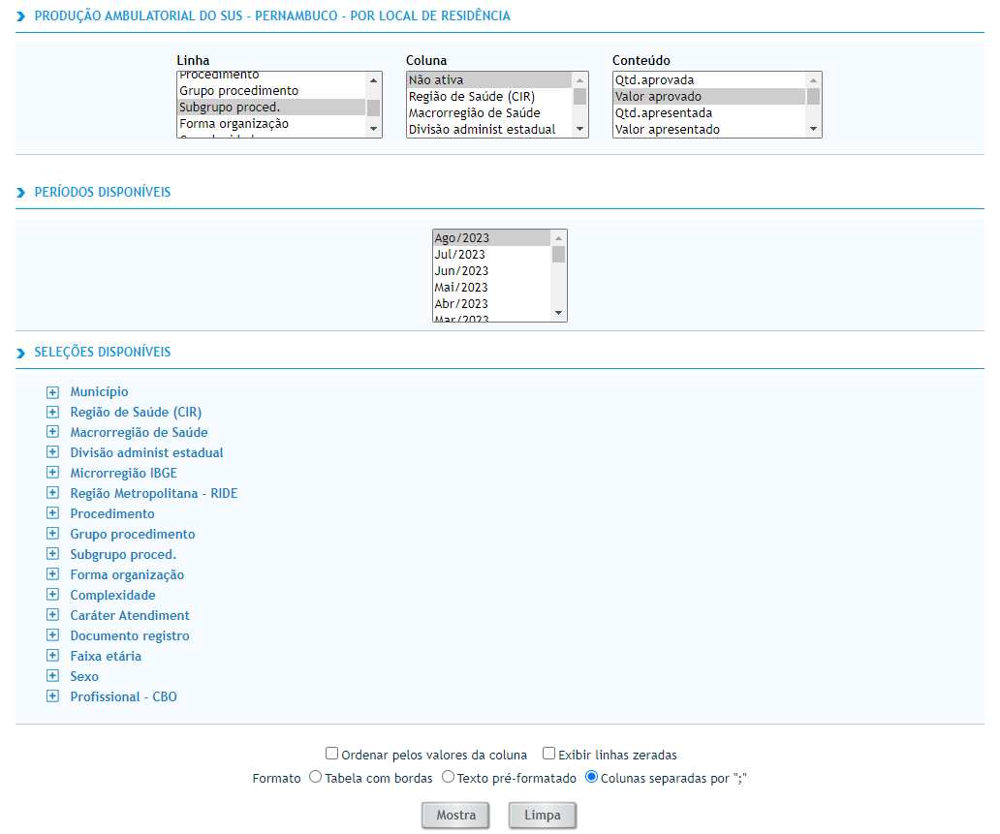
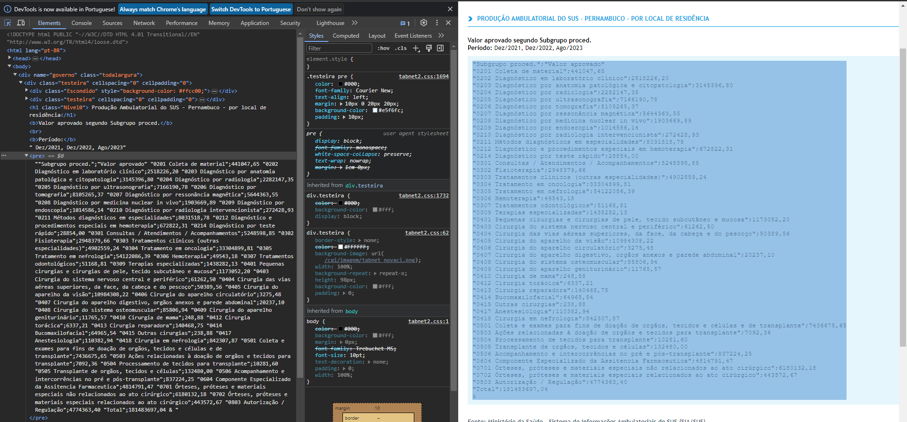
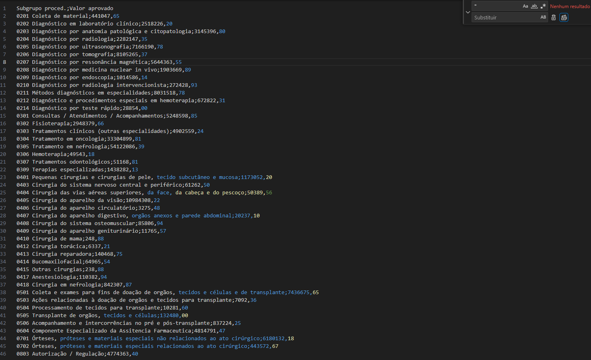

# ETL e Análise de dados - Sistema de Informação Ambulatorial
Extração, Transformação, Carregamento e Análise da base de dados do Sistema de Informação Ambulatorial (SIA) no estado de Pernambuco

## Como executar

1. Extrair os arquivos **data\001_PYSUS.rar** e **data\002_TABNET.rar**
3. Executar o arquivo **003_SIA_Join_Datasets.ipynb**
4. Realizar as análises no arqivo **004_Data_Analysis.ipynb**

## Descrição da base de dados

O Sistema de Informação Ambulatorial (SIA) foi implantado nacionalmente na década de noventa (Julho de 1994), visando o registro dos atendimentos realizados no âmbito ambulatorial, por meio do Boletim de Produção Ambulatorial (BPA). Ao longo dos anos, o SIA vem sendo aprimorado para ser efetivamente um sistema que gere informações referentes ao atendimento ambulatorial e que possa subsidiar os gestores estaduais e municipais no monitoramento dos processos de planejamento, programação, regulação, avaliação e controle dos serviços de saúde, na área ambulatorial.

Com a evolução do SUS para uma gestão cada vez mais descentralizada, o Ministério da Saúde (MS), necessitou de dispor de um sistema de informação para o registro dos atendimentos ambulatoriais, padronizado em nível nacional, que possibilitasse a geração de informações facilitando o processo de planejamento, controle, avaliação e auditoria. 

### Contexto da coleta dos dados

**Entradas**

- **SIGTAP (Sistema de Gerenciamento da Tabela de Procedimentos, Medicamentos e Órteses, Próteses e Materiais Especiais do SUS):** Sistema fundamental para o gerenciamento e a atualização da tabela de procedimentos, medicamentos e OPM (e Procedimentos, Medicamentos e Órteses, Próteses e Materiais Especiais) utilizados pelo SUS.
- **CNES (Cadastro Nacional de Estabelecimentos de Saúde):** Sistema fundamental para o gerenciamento e a atualização do cadastro de todos os estabelecimentos de saúde do país, contribuindo para o planejamento, a gestão e o controle dos serviços de saúde em todo o território nacional.
- **FPOmag**: Fundo que apoia a execução de projetos estratégicos que promovam o desenvolvimento sustentável nessas regiões.

**Saídas**

- **TABNET:** Instrumento online tabulador de diversas informações de saúde. Há um módulo específico desta ferramenta na página do DATASUS para consulta da produção ambulatorial. 
- **TABWIN:** Aplicativo tabulador de informações de saúde para Windows. Todos os arquivos de configuração (DEF/CNV) e de produção (PA) necessários para que o Tabwin consulte a produção ambulatorial estão disponíveis no site do DATASUS. Quando esta ferramenta é utilizada para este fim é também denominada TABSIA.
- **MSBBS/DATASUS:** Os arquivos de produção ambulatorial (PA) podem ser obtidos sem necessidade de utilizar o Tabwin. Por serem arquivos Dbase (DBF) compactados, podem ser importados e tratados por outras ferramentas de banco de dados.

**Disponibilidade dos dados**

- **Tempo Previsto:** A divulgação nacional dos resultados é realizada mensalmente.
- **Nível de Divulgação:** Nacional, com detalhamento no nível estadual, municipal e de estabelecimentos.
- **Formas de Disseminação:** Internet, boletins, anuários, CD-ROM.

### Desafios existentes nos dados nesse Sistema de Informação Ambulatorial (SIS)

- **Qualidade dos dados:** Os dados podem estar incompletos, inconsistentes ou incorretos, o que pode comprometer sua utilidade para a tomada de decisão em saúde.
- **Padronização dos dados:** Isso pode dificultar a análise dos dados e a comparação entre diferentes regiões ou unidades de saúde.
- **Subnotificação:** A subnotificação de casos e procedimentos é outro desafio que pode comprometer a precisão dos dados do SIA.

## Desafios do projeto

1. Identificar os **procedimentos** realizados por **profissionais** não especializados
2. Identificar os municípios recebem valor de **verba** inconsistente em relação a quantidade de **atendimentos realizados**.

## Descrição das variáveis utilizadas

| Variável                  | Descrição                                                    |
| ------------------------- | ------------------------------------------------------------ |
| Município                 | Município de Pernambuco                                      |
| Profissional - CBO        | Profissional segundo a Classificação Brasileira de Ocupações |
| Grupo Procedimento        | Grupo do procedimento realizado, de acordo com a Tabela de Procedimentos, Medicamentos, Órteses e Próteses e Materiais Especiais do SUS |
| Subgrupo Procedimento     | Subgrupo do procedimento realizado, de acordo com a Tabela de Procedimentos, Medicamentos, Órteses e Próteses e Materiais Especiais do SUS |
| Complexidade              | Subgrupo do procedimento realizado, de acordo com a Tabela de Procedimentos, Medicamentos, Órteses e Próteses e Materiais Especiais do SUS |
| Ano/Mês processamento     | Ano e Mês de processamento/movimento dos dados.              |
| Qtd. aprovada             | Quantidade de procedimentos aprovados para pagamento pelas Secretarias de Saúde. |
| Valor aprovado            | Valor aprovado para pagamento pelas Secretarias de Saúde.    |
| Indicadores de evolução   | Indicadores utilizados para monitorar a evolução e as atividades dos pacientes (Encerramento, Alta, Transferência, Óbito) |
| Informações de residência | Informações de residência do paciente (Estado ou Município do paciente é diferente da localização do estabelecimento) |

## Coleta e tratamento de dados do SIA

### Fase 1: Extração de ocorrências do SIA - PySUS

***Arquivo: 001_SIA_PySUS.ipynb***

1. Instalado a biblioteca `pysus` usando o comando `!pip install pysus`.
2. Importado as funcionalidades relacionadas ao SIA do pacote `pysus`.
3. Definido o período de anos (2021, 2022 e 2023) e meses (de 1 a 12) para extração dos dados.
4. Iterado pelos anos e meses desejados.
5. Para cada mês e ano, foi baixado os dados do SIA para o estado de Pernambuco (PE) usando a função `download`. Os dados foram obtidos através do tipo de dado Produção Ambulatorial **(group='PA')**
6. Se os dados estiveram disponíveis, foi convertido de formato Parquet em um DataFrame do Pandas
7. Selecionado apenas as colunas relevantes para análise a partir de um dicionário chamado `selected_columns`
8. Transformado a coluna de data **'PA_CMP' (Data da Realização do Procedimento)** de formato *YYYYMM* para *DD/MM/YYYY*
9. Criado colunas adicionais **'PA_G_PROC_ID' (Procedimento-Grupo)** e **'PA_SG_PROC_ID' (Procedimento-Subgrupo)** com base na coluna **'PA_PROC_ID' (Procedimento realizado)**
10. Convertido os valores contábeis em formato string para números inteiros **'PA_QTDAPR' (Quantidade aprovada)** e números de ponto flutuante **'PA_VALAPR' (Valor aprovado)**
11. Foi salvo DataFrame em um arquivo CSV com um nome específico para o mês e ano correspondentes no caminho especificado ***(Ex: SIA_2023_08.csv)***.

### Fase 2: Extração da descrição dos códigos - TabNet

***Arquivo: 002_SIA_TABNET.ipynb***

1. Os dados descritivos foram obtidos a partir do TabNet do DataSUS.

2. Inicialmente, foi selecionado a variável que desejamos na opção de **Linha.**

   </img>

3. Ao inspecionar o elemento que contém o texto csv, é extraído os dados.

   </img>

4. É realizado um breve tratamento na remoção de aspas no arquivo.

   </img>

5. Foi feita uma operação para criar duas novas colunas no DataFrame **(<variavel>**e **DS_<variavel>)**. Que contém o código e a descrição numérico do variável, respectivamente.

### Fase 3: Conversão e manipulação dos arquivos CSV para Parquet

***Arquivo: 003_SIA_Join_Datasets.ipynb***

Os dados extraídos do PySUS foram unidos com os dados descritivos obtidos no TabNET. O dataset do PySUS consiste em um total de 33.831.473 linhas, o que pode ser bastante volumoso e demandar recursos significativos para processamento.

**Dados do PySUS**

```python
df_pysus = spark.read.parquet(PATH_PYSUS_PARQUET)
df_pysus.printSchema()
```

```python
root
 |-- PA_UFMUN: integer (nullable = true)
 |-- PA_PROC_ID: integer (nullable = true)
 |-- PA_NIVCPL: integer (nullable = true)
 |-- PA_CBOCOD: string (nullable = true)
 |-- PA_OBITO: integer (nullable = true)
 |-- PA_ENCERR: integer (nullable = true)
 |-- PA_PERMAN: integer (nullable = true)
 |-- PA_ALTA: integer (nullable = true)
 |-- PA_TRANSF: integer (nullable = true)
 |-- PA_QTDAPR: integer (nullable = true)
 |-- PA_VALAPR: double (nullable = true)
 |-- PA_UFDIF: integer (nullable = true)
 |-- PA_MNDIF: integer (nullable = true)
 |-- PA_G_PROC_ID: integer (nullable = true)
 |-- PA_SG_PROC_ID: integer (nullable = true)
 |-- PA_CMP: date (nullable = true)

CPU times: total: 0 ns
Wall time: 230 ms
```

**Dados descritivos do Município**

```python
df_ufmun = spark.read.csv(PATH_TABNET_UFMUN, sep=';', header=True, inferSchema=True)
df_ufmun.printSchema()
```

```python
root
 |-- PA_UFMUN: integer (nullable = true)
 |-- DS_PA_UFMUN: string (nullable = true)
```

**Join dos DataFrames**

```python
df = df_pysus.join(df_ufmun, 'PA_UFMUN', how='left')
df.select('PA_UFMUN', 'DS_PA_UFMUN', 'PA_QTDAPR', 'PA_VALAPR')\
  .show(3, False)
```

```python
+--------+-----------+---------+---------+
|PA_UFMUN|DS_PA_UFMUN|PA_QTDAPR|PA_VALAPR|
+--------+-----------+---------+---------+
|261160  |RECIFE     |1        |1.85     |
|260680  |IGARASSU   |1        |0.0      |
|261160  |RECIFE     |2        |3.7      |
+--------+-----------+---------+---------+
only showing top 3 rows
```

Para melhorar o desempenho de processamento desses dados, foi optado por converter o arquivo CSV em formato Parquet utilizando a biblioteca PySpark. O formato Parquet é um formato de armazenamento de dados colunares altamente eficiente e amplamente utilizado em ecossistemas de big data, como o Hadoop.

**Lendo o arquivo csv do dataset PySUS**

```python
df_pysus = spark.read.csv(PATH_PYSUS, sep=';', header=True, inferSchema=True)
```

```python
CPU times: total: 0 ns
Wall time: 18.3 s
```

**Lendo o arquivo Parquet do dataset PySUS**

```python
df_pysus = spark.read.parquet(PATH_PYSUS_PARQUET)
```

```python
CPU times: total: 0 ns
Wall time: 238 ms
```

### Fase 4: Analisando os dados obtidos

***Arquivo: 004_Data_Analysis.ipynb***

Inicialmente, fez-se necessário definir como será quantificado a realização de procedimentos: contagem de linhas no Dataset x somatório da coluna PA_QTDAPR (Quantidade de procedimentos aprovados para pagamento pelas Secretarias de Saúde).<br>

Após comparações dos dados obtidos do PySUS e TabNet, chegou a conclusão de que a contagem de linhas no Dataset será definido para quantificar a realização de procedimentos. Segue um exemplo de como foi realizado esta definição:

> A coluna **COUNT(1)** realiza a contagem de linhas<br>
> A coluna **SUM(PA_QTDAPR)** realiza o somatório da quantidade aprovada para pagamento<br>
</img>

> Os dados do TABNET são mais próximos da coluna **COUNT(1)**<br>
</img>

#### Identificação de procedimentos realizados por profissionais não especializados

Foi apresentado gráficos que evidenciam procedimentos ambulatoriais que foram realizados por profissionais não especializados. Como na imagem abaixo, onde, diversos profissionais distintos realizaram o procedimento de Radiografia de Toxa em Petrolina.
</img>

#### Identificação de municípios que recebem valor de verba inconsistente em relação a quantidade de atendimentos realizados

Ao realizar a análise dos procedimentos mais caros realizados comparando o município com **maior valor médio** pago por atendimento (Itambé) e o município com **menor valor médio** pago por atendimento (Brejo da Madre de Deus). É notável a diferença entre os valores obtidos considerando o mesmo procedimento. Por exemplo, o **Atendimento de Urgência em Atenção Especializada** é muito mais caro no município de Itambé (10.944,06 Reais por atendimento) do que no município de Brejo da Madre de Deus (1741,71 Reais por atendimento). A mesma diferença é observada em outros procedimentos, como:  Dosagem de Hemoglobina Glicolisada, Dosagem de Colesterol e Atendimento de Urgência c/ Observação até 24h em Atenção Especializada.
</img>

#### Outros resultados

Os profissionais, como "Medico em medicina nuclear" e "Farmaceutico," se destacam ao realizarem predominantemente procedimentos classificados como "Alta Complexidade," com porcentagens acima de 98%. 
</img>

Nesta análise, foram selecionados profissionais que apresentaram mais de 100 mil atendimentos entre os anos de 2021 e 2022 (anos em que temos registros completos de janeiro à dezembro). Além disso, considerou-se como critério de análise os cinco profissionais com maior resultado no indicador de coeficiente de variação entre os meses.<br>

Uma observação importante é a drástica diminuição na quantidade de atendimentos a partir do mês de setembro. Entre os profissionais selecionados, o médico oftalmologista se destacou com o maior número de atendimentos ao longo do período, com uma média mensal superior a 400 mil procedimentos. No entanto, é notável que sua carga de trabalho também sofreu uma queda acentuada a partir de Setembro.<br>

Os outros quatro profissionais, Farmacêutico, Enfermeiro, Fisioterapeuta geral e Médico em radiologia e diagnóstico por imagem, também tiveram um número significativo de atendimentos, mas experimentaram quedas similares em Setembro. Suas cargas de trabalho, embora tenham variado mês a mês, demonstraram uma tendência de queda.
</img>

O município de Verdejante ocupando a última posição em termos de valor pago. Esses números podem indicar desafios na infraestrutura de saúde, acesso aos serviços de saúde ou até mesmo a baixa demanda por atendimentos ambulatoriais nessas regiões.
</img>

Municípios como Garanhuns, Palmares, e Arcoverde atraem uma parcela considerável de pacientes de outros municípios, possivelmente devido à oferta de serviços de saúde mais abrangentes e de qualidade em suas respectivas regiões. 
</img>

## Referências

*Produção Ambulatorial do SUS por local de atendimento – a partir de 2008 - Notas Técnicas. Disponível em: http://tabnet.datasus.gov.br/cgi/sia/Prod_amb_loc_atend_2008.pdf*

*AUDITORIA NO SUS: NOÇÕES BÁSICAS SOBRE SISTEMAS DE INFORMAÇÃO. Disponível em: https://bvsms.saude.gov.br/bvs/publicacoes/auditoria_sus.pdf*

*Auditoria no SUS: noções básicas sobre Sistemas de Informações. Disponível em: https://bvsms.saude.gov.br/bvs/publicacoes/auditoria_sus2004_2.pdf*

*Disseminação de Informações do Sistema de Informações Ambulatoriais (SIA). Disponível em: http://w3.datasus.gov.br/siasih/Arquivos/SIASUS_Informe_T%C3%A9cnico_2008-01.pdf*

*ESTUDO DE VIABILIDADE DE REÚSO DA ONTOLOGIA PLP (Patient Life Path) PARA INTEGRAÇÃO SEMÂNTICA DE DADOS ABERTOS DA ÁREA DA SAÚDE. Disponível em: https://repositorio.utfpr.edu.br/jspui/bitstream/1/23715/1/CT_COSIS_2019_2_07.pdf*